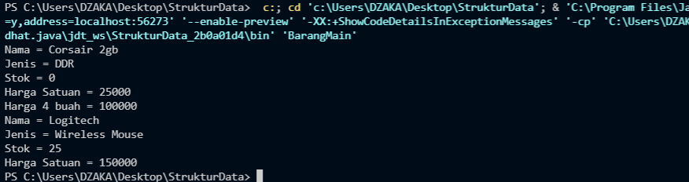

# JOBSHEET 2 PRAK ASD
## Nama: Muhammad Dzaka Murran Rusid
## Kelas/abs: 1F_D4-TI/18 
### <br>2.1 Tujuan Praktikum
Setelah melakukan materi praktikum ini, mahasiswa mampu:
1. Mengenal objek dan class sebagai konsep mendasar pada pemrograman berorientasi objek
2. Mendeklarasikan class, atribut dan method
3. Membuat objek (instansiasi)
4. Mengakses atribut dan method dari suatu objek
5. Menerapkan konstruktor 
### <br>2.2 Deklarasi Class, Atribut dan Method
#### <br>2.2.1 Langkah-langkah Percobaan
1. Buat Project baru, dengan nama StrukturData. Buat paket dengan nama minggu2, buatlah class 
baru dengan nama Barang.
2. Lengkapi class Barang dengan atribut dan method yang telah digambarkan di dalam diagram 
class di atas, sebagai berikut:
<br> 
```java
public class Barang{
    String namaBarang, jenisBarang;
    int stok, hargaSatuan;

    void tampilBarang(){
        System.out.println("Nama = "+namaBarang);
        System.out.println("Jenis = "+jenisBarang);
        System.out.println("Stok = "+stok);
        System.out.println("Harga Satuan = "+hargaSatuan);
    }

    void tambahStok(int n){
        stok=stok+n;
    }

    void kurangiStok(int n){
        stok=stok-n;
    }

    int hitungHargaTotal(int jumlah){
        return jumlah*hargaSatuan;
    }
}
```
3. Coba jalankan (Run) class Barang tersebut. Apakah bisa?

#### <br> 2.2.2 Verifikasi Hasil Percobaan
Program tidak bisa dijalankan karena tidak ada main class

#### <br>2.2.3 Pertanyaan
1. Sebutkan 2 karakteristik class/objek!
<br>**Karakteristik class/objek adalah: <br>-Memiliki sesuatu
data/karakter/properti/variabel/state/field/atribut 
<br>-Bisa melakukan sesuatu tingkah laku/behaviour/fungsi/method** 
2. Kata kunci apakah yang digunakan untuk mendeklarasikan class? 
<br>
```java
public class NamaClass{

}
```
3. Perhatikan class Barang yang ada di Praktikum di atas, ada berapa atribut yang dimiliki oleh class 
tersebut? Sebutkan! Dan pada baris berapa saja deklarasi atribut dilakukan?
<br>
**ada 4 atribut yang dimiliki oleh class Barang. Deklarasi atribut dilakukan pada baris ke-13 dan 14 jika sesuai dengan gambar diatas. 
<br>
``
String namaBarang, jenisBarang;
int stok, hargaSatuan;
``**
4. Ada berapa method yang dimiliki oleh class tersebut? Sebutkan! Dan pada baris berapa saja deklarasi method dilakukan?
<br>
**ada 4 method yang dimiliki oleh class tersebut. Deklarasi method dilakukan pada baris ke-16,23,27, dan 31.
<br>
``
void tampilBarang();
void tambahStok(int n);
void kurangiStok(int n);
int hitungHargaTotal(int jumlah);
``**
5. Perhatikan method kurangiStok() yang ada di class Barang, modifikasi isi method tersebut sehingga proses pengurangan hanya dilakukan jika stok masih ada (masih lebih besar dari 0) 
```java
 void kurangiStok(int n){
        if(stok>0){
        stok=stok-n;
        }
    }
```
6. Menurut Anda, mengapa method tambahStok() dibuat dengan memiliki 1 parameter berupa 
bilangan int?
<br>
**Agar nantinya dapat diberikan nilai berupa integer ke method *tambahStok()* sehingga methodnya akan jalan di class main dengan nilai integer yang telah diberikan**
7. Menurut Anda, mengapa method hitungHargaTotal() memiliki tipe data int?
<br>
**Karena method tersebut meminta nilai kembali berupa integer dari operasi yang dilakukan didalam method *hitungHargaTotal()* tersebut.**
8. Menurut Anda, mengapa method tambahStok() memiliki tipe data void?
<br>
**Karena method tersebut tidak meminta suatu nilai kembali dan hanya bertugas menjalankan operasi didalamnya.**
<br>
### <br>2.3 Instansiasi Objek dan Mengakses Atribut & Method
Waktu : 45 Menit
Sampai tahap ini, kita telah membuat class Barang dengan sukses. Selanjutnya, apabila diinginkan 
untuk mulai menggunakan class Barang tersebut, mengakses atribut-atribut dan method-method 
yang ada di dalamnya, maka selanjutnya perlu dibuat objek/instance dari class Barang terlebih dahulu.
#### <br>2.3.1 Langkah-langkah Percobaan
1. Di dalam paket minggu2, buatlah class baru dengan nama BarangMain. Dan di dalam class 
BarangMain tersebut, buatlah method main().
2. Di dalam method main(), lakukan instansiasi, dan kemudian lanjutkan dengan mengakses atribut 
dan method dari objek yang telah terbentuk.
```java
public class BarangMain {
    public static void main(String[] args){
        Barang b1 = new Barang();
        b1.namaBarang = "Corsair 2gb";
        b1.jenisBarang = "DDR";
        b1.hargaSatuan = 25000;
        b1.stok = 10;
        b1.tambahStok(1);
        b1.kurangiStok(3);
        b1.tampilBarang();
        int hargaTotal = b1.hitungHargaTotal(4);
        System.out.println("Harga 4 buah = "+hargaTotal);
    }
}
```
3. Jalankan (Run) class BarangMain tersebut dan amati hasilnya.
<br>
#### 2.3.2 Verifikasi Hasil Percobaan


#### 2.3.3 Pertanyaan
1. Pada class BarangMain, pada baris berapakah proses instansiasi dilakukan? Dan apa nama objek yang dihasilkan?
**<br>Proses instansiasi terjadi di baris 15 sesuai gambar dengan objek yang dihasilkan adalah objek *bl***

2. Bagaimana cara mengakses atribut dan method dari suatu objek?

**<br>-Cara mengakses atribut:**
```java
tipeData namaAtribut;
```
**-Cara mengakses method:**
```java
tipeData namaMethod(tipeData param){
    //isi method
}
```

### <br>2.4 Membuat Konstruktor
Waktu : 45 Menit
Di dalam percobaan ini, kita akan mempraktekkan bagaimana membuat berbagai macam 
konstruktor berdasarkan parameternya.

#### 2.4.1 Langkah-langkah Percobaan
1. Perhatikan kembali class Barang. Tambahkan di dalam class Barang tersebut 2 buah 
konstruktor. 1 konstruktor default dan 1 konstruktor berparameter.
```java
public class Barang{
    String namaBarang, jenisBarang;
    int stok, hargaSatuan;

    Barang(){

    }
    Barang(String nm, String jn, int st, int hs){
        namaBarang = nm;
        jenisBarang = jn;
        stok = st;
        hargaSatuan = hs;
    }
    void tampilBarang(){
        System.out.println("Nama = "+namaBarang);
        System.out.println("Jenis = "+jenisBarang);
        System.out.println("Stok = "+stok);
        System.out.println("Harga Satuan = "+hargaSatuan);
    }

    void tambahStok(int n){
        stok=stok+n;
    }

    void kurangiStok(int n){
        if(stok>0){
        stok=stok-n;
        }
    }

    int hitungHargaTotal(int jumlah){
        return jumlah*hargaSatuan;
    }
}
```
2. Buka kembali class BarangMain. Dan buat sebuah objek lagi, kali ini dengan menggunakan konstruktor berparameter
```java
public class BarangMain {
    public static void main(String[] args){
        Barang b1 = new Barang();
        b1.namaBarang = "Corsair 2gb";
        b1.jenisBarang = "DDR";
        b1.hargaSatuan = 25000;
        b1.stok = 0;
        b1.kurangiStok(3);
        b1.tampilBarang();
        int hargaTotal = b1.hitungHargaTotal(4);
        System.out.println("Harga 4 buah = "+hargaTotal);
        Barang b2 = new Barang("Logitech", "Wireless Mouse", 25, 150000);
        b2.tampilBarang();
    }
}
```
3. Jalankan kembali class BarangMain dan amati hasilnya.
#### <br>2.4.2 Verifikasi Hasil Percobaan


#### <br>2.4.3 Pertanyaan
1. Perhatikan class Barang yang ada di Praktikum 2.4.1, pada baris berapakah deklarasi 
konstruktor berparameter dilakukan?
<br>
**Deklarasi konstruktor berparameter dilakukan pada baris 18-23 sesuai di gambar**
```java
Barang(String nm, String jn, int st, int hs){
        namaBarang = nm;
        jenisBarang = jn;
        stok = st;
        hargaSatuan = hs;
    }
```
2. Perhatikan class BarangMain di Praktikum 2.4.1, apa sebenarnya yang dilakukan pada baris 
program dibawah ini?
```java
 Barang b2 = new Barang("Logitech", "Wireless Mouse", 25, 150000);
```
**Baris program tersebut merupakan proses instansiasi objek b2 berparameter dengan menggunakan konstruktor/method special sehingga ketike program dijalankan baris tersebut langsung merujuk ke konstruksi berparameter yang ada di class Barang.**

### <br> 2.5 Latihan Praktikum
1. **Latihan1.java** 
```java
package LatithanPraktikum1;

public class Latihan1 {
    String nama;
    int hargaSatuan, jumlah;


    int hitungHargaTotal(){
        return hargaSatuan*jumlah;
    }
    
    int hitungDiskon(){
        int diskon = 0;
        if(hitungHargaTotal()>100000){
            diskon = hitungHargaTotal()*10/100;
        }else if(hitungHargaTotal()>50000&&hitungHargaTotal()<=100000){
            diskon = hitungHargaTotal()*5/100;
        }else{
        
        }
        return diskon;
    }

    int hitungHargaBayar(){
        return hitungHargaTotal()-hitungDiskon();
    }
}
```
**Latihan1main.java**
```java
import java.util.Scanner;
public class Latihan1main {
    public static void main(String[] args) {
        Latihan1 p1 = new Latihan1();
        Scanner kipe = new Scanner(System.in);
        p1.nama="Permen";
        p1.hargaSatuan=5000;
        
        System.out.println(p1.nama);
        System.out.println("Harga : "+p1.hargaSatuan);
        System.out.println(" ");
        
        System.out.print("Jumlah pesanan anda : ");
        int beli = kipe.nextInt();
        p1.jumlah = beli;

        p1.hitungHargaTotal();
        p1.hitungDiskon();
        p1.hitungHargaBayar();

        if(p1.hitungDiskon()<=50000){
            System.out.println("Diskon yang didapatkan : "+p1.hitungDiskon());
            System.out.println(("Total harga (setelah dipotong diskon) : ")+ p1.hitungHargaBayar());
        }else{
            System.out.println("Maaf, anda tidak mendapatkan diskon");
            System.out.println(("Total harga : ")+ p1.hitungHargaBayar());
        }
    }
}
```
**HASIL OUTPUT**
<br>

<br><br>
2. **Latihan2.java**
```java
package LatihanPraktikum2;

public class Latihan2 {
    int x, y, width, height;

    void moveLeft(){
        if(x<0&&x<width);
        x-=1;
    }
    void moveRight(){
        if(x>0&&x<width);
        x+=1;
    }
    void moveUp(){
        if(y>0&&y<height);
        y+=1;
    }
    void moveDown(){
        if(y<0&&y<height);
        y-=1;
    }
    void printPosition(){
        System.out.print("Koordinat "+x+" dan "+y);
    }
}
```
**Latian2main.java**
```java
package LatihanPraktikum2;

public class Latihan2main {
    public static void main(String[] args) {
        Latihan2 koor = new Latihan2();
        koor.x=0;
        koor.y=0;
        koor.width=20;
        koor.height=20;
        koor.moveUp();
        koor.moveDown();
        koor.moveLeft();
        koor.moveRight();

        System.out.println("\nPROGRAM PACMAN :)");
        System.out.println("Titik awal koordinat saat ini : ");
        koor.printPosition();
        System.out.println("\nLalu bergerak kekiri 2x menjadi ");
        koor.moveLeft();
        koor.moveLeft();
        koor.printPosition();
        System.out.println("\nKemudian bergerak keatas menjadi ");
        koor.moveUp();
        koor.printPosition();
        System.out.println("\nSetelah itu bergerak kekanan menjadi ");
        koor.moveRight();
        koor.printPosition();
        System.out.println("\nTujuan terakhir pacman berada setelah turun kebawah 1x, yaitu ");
        koor.moveDown();
        koor.printPosition();
    }
}
```
**OUTPUT**
<br>


